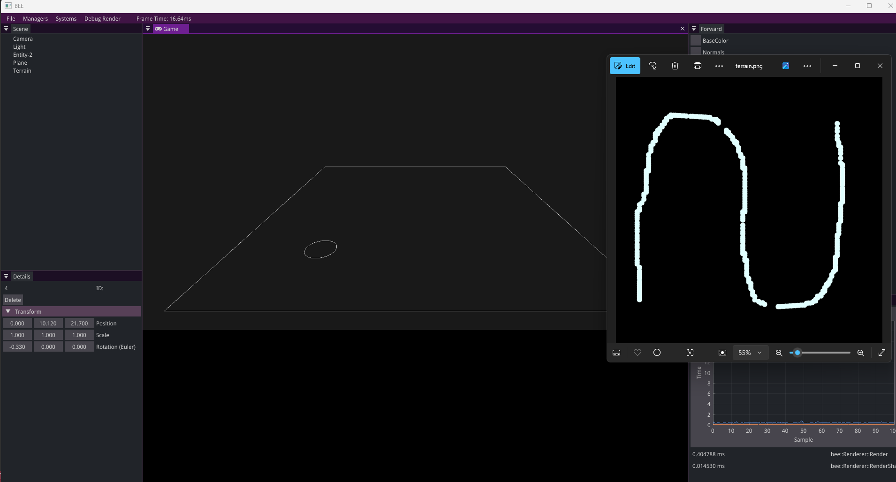
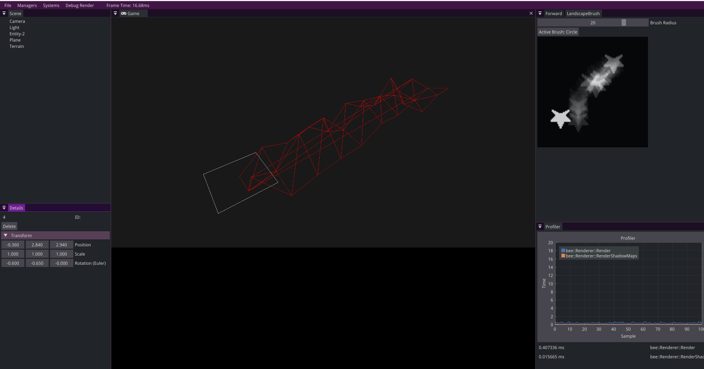
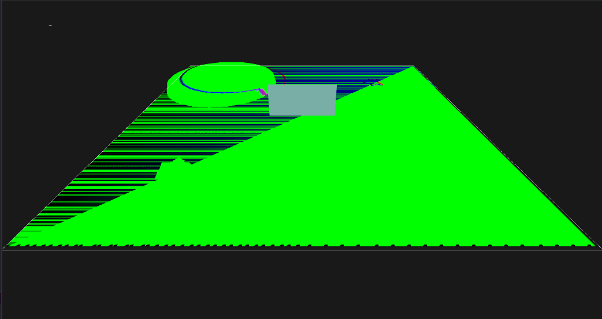
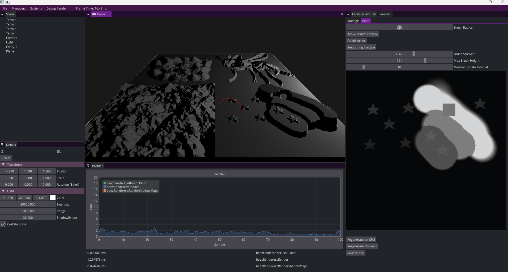

As a student, __I can create and adapt a detailed plan for my project__, so that I take steps towards my dream career in a structured way.

# 💭 Suggested Evidence
- Week 1 self-study plan
- Weekly progress reviews
- Group meeting attendance
- Roundtable survey

# 💯 Detailed Rubric

🔴 **Poor:** The student has handed in their study plan on time. The plan is complete and has acceptable content.

🟠 **Insufficient:** The student has processed teacher feedback on the initial study plan. The student has attended most study-group meetings. The Learning Log section for this ILO contains a progress review for most weeks.

🟡 **Sufficient:** The student has proactively participated in all study-group meetings. Each week, the Learning Log contains a progress review with an actionable plan for the upcoming week.

🟢 **Good:** The student has evaluated their study plan over time and has adapted it when needed, based on critical self-review and feedback received (e.g. during the study-group meetings).

🔵 **Excellent:** The student reflects well on their developed skills and on their progress towards their dream career. The Learning Log shows critical reflection and lessons learned about managing a study project. 

# 🔍 Evidence

## Week 1️⃣: Self-study plan

*Give an outline of your self-study plan. You don't have to present the complete plan here (you're already handing in the one-pager on Brightspace!), but just repeat the most important points.*

*Job title:* Senior Tools Programmer at Epic Games

*Project title:* Terrain brushes for the Bee engine

*Week 3 milestone:* Be able to “paint” on a surface and have that be saved to a greyscale png.

*Week 5 milestone:* Upon loading in the terrain have the height of the polygons in the grid be dependent on the heightmap from the png using either just a bunch of planes or doing it the way the OpenGL article below instructs. 

*Week 7 milestone:* Optimize the brush so that real time editing of the terrain goes smoothly without lag and add a fitting UI that helps the user with the brush (brushsize, strength, etc.)

*Stress tests:* I can increase the polycount in the terrain to test performance on high-level terrains. And I can test how big the brush can be (how many polygons will be updated at the same time). I will make use of the bee engine profiler for this. 

*Stretch goals:* 
- Having the colour of the polygon be bound to the height of the polygons which can make for some cool mountain like effects. 
- User defined shapes for brushes. 
- Noise based brushes. 

## Week 2️⃣: Progress meeting

*Make sure you can give a live demo of your project during the weekly meeting. Paste a screenshot/video here.* 

*What have you been doing over the past week? How much time did it take?*   
- Made my self study plan.
- Researched terrain generation and terrain brushes in other engines. 
- Researched terrain rendering.
- Made the bee engine compile and started working on a brush which saves to a .png. 

*What problems/challenges (foreseen or unforeseen) did you run into?*   
I knew that getting the brush position and where it paints on the canvas and eventually saving that to a .png would take a bit of time but I eventually figured it out. What took some time was figuring out and better understanding the stb_image library. I still have to decide whether I want to save it as 8 or 16 bit. 

*What are you planning to do in the upcoming week?*     
Visualize what you paint in the editor (I am thinking of something with ImGui) and better refine the brush by having it paint with a falloff, strength, etc.  

*Are you on track overall? Do you need to adjust your milestones / stress tests (either up or down)? If so, what are your new milestones / stress tests?*       
I think as of now I am on track so I wont be changing any of my milestones. I will however add "Tri-planar mapping" as a stretch goal after talking to Bojan about my self-study plan. 

*Do you have any technical questions you need help with? If so, what are they?*     
No.

## Week 3️⃣: Progress meeting

*Make sure you can give a live demo of your project during the weekly meeting. Paste a screenshot/video here.* 

*What have you been doing over the past week? How much time did it take?*
This past week i've been buisy with adding texture drawing for the heightmaps. I have also been researching the rendering aspect of the terrain more. 

*What problems/challenges (foreseen or unforeseen) did you run into?*
It took a bit of trial and error to get the texture drawing working but eventually i got there. 
I am totally not familiar with rendering yet and I will have to spend a lot of time trying to get that working in my project. 

*What are you planning to do in the upcoming week?*
Get a grid of triangles to be drawn according to the heightmap put in by the user. 

*Are you on track overall? Do you need to adjust your milestones / stress tests (either up or down)? If so, what are your new milestones / stress tests?*
I have put the "User defined brushes" stretchgoal to the week 3 milestone. But I feel like I am on track. 

*Do you have any technical questions you need help with? If so, what are they?*
No.

## Week 4️⃣: Progress meeting

*Make sure you can give a live demo of your project during the weekly meeting. Paste a screenshot/video here.* 

*What have you been doing over the past week? How much time did it take?*
Last week I have been trying to get some rendering working and trying to get a better understanding of how OpenGL and glsl work. 
...

*What problems/challenges (foreseen or unforeseen) did you run into?*
Me having a hard time getting textures to work in shaders. 
...

*What are you planning to do in the upcoming week?*
Getting the heightmap to render the right way, maybe with textures. 
...

*Are you on track overall? Do you need to adjust your milestones / stress tests (either up or down)? If so, what are your new milestones / stress tests?*
I think so? I feel like i am behind because the rendering takes me quite long but I am still somewhat on track i believe. 
...

*Do you have any technical questions you need help with? If so, what are they?*

...

## Week 5️⃣: Progress meeting

*Make sure you can give a live demo of your project during the weekly meeting. Paste a screenshot/video here.* 

*What have you been doing over the past week? How much time did it take?*

I have been working on getting the rendering working, this took me a bit long to understand because I was very unfamiliar with the way BEE handles it's rendering. 
Right now my code is just kind of chucked into the rendering loop, I would like to eventually put this into my own files. I have also fixed some small brush regarding bugs i still had. 

*What problems/challenges (foreseen or unforeseen) did you run into?*

That getting the heightmap into the vertex shader would take so much time. I tried to go with the way BEE handles it but it was quite a task. 

*What are you planning to do in the upcoming week?*

Getting normal calculation and some texturing. 

*Are you on track overall? Do you need to adjust your milestones / stress tests (either up or down)? If so, what are your new milestones / stress tests?*
Yes. 

*Do you have any technical questions you need help with? If so, what are they?*

...

## Week 6️⃣: Progress meeting

*Make sure you can give a live demo of your project during the weekly meeting. Paste a screenshot/video here.* 
In the image below I show that i am working on my normal generation. There is something happening but all the normals are mirrored and there is a huge artifact which covers half of the terrain. 

*What have you been doing over the past week? How much time did it take?*
I have spent a lot of time getting back into it after the vacation and generating normals for my heightmap. Generating the normals took most of my week because of an issue I have explained below. 

*What problems/challenges (foreseen or unforeseen) did you run into?*
What took me a really long time was generating the normals correctly, this was partly because I did not yet understand the math behind it well enough and it took me a really long time to figure out that the max mesh size for bee was 255x255. Before I tried it with a higher subdivision count but then the uint16_t which stored the normals, which has a max value of 65535, would overflow at a certain point which would mess up the normals. At first I thought it had something to do with the UV's not being correct and there being something wrong in my generation, so I spent a long time looking in the wrong place.  

*What are you planning to do in the upcoming week?*
I got the feedback from Bert that i should spend more of my time actually building the right things which makes a good tool. Brushes that can actually make mountains, good mouse-mountain interseciton, etc.
I will also rework a bit of my system so i can load in and render more than 1 heightmap at a time by doing some sort of heightmap ID system. 
I will also start with the optimization of my tool by finding hotspots in my code. 

*Are you on track overall? Do you need to adjust your milestones / stress tests (either up or down)? If so, what are your new milestones / stress tests?* 
My week 7 milestone was: Optimize the brush so that real time editing of the terrain goes smoothly without lag and add a fitting UI that helps the user with the brush (brushsize, strength, etc.). I will also be updating my stresstest from amount of subdivisions to how many times per frame we can update the normals. 

I will change this to: Optimize the brush so that real time editing of the terrain goes smoothly without lag and add multiple brushes such as smoothing, falloff, etc. Start with making my API a bit cleaner and user friendly. 

*Do you have any technical questions you need help with? If so, what are they?*
No. 

## Week 7️⃣: Progress meeting

*Make sure you can give a live demo of your project during the weekly meeting. Paste a screenshot/video here.* 
Here you can see that I fixed all the normals and I am able to load and render multiple heightmaps. 

*What have you been doing over the past week? How much time did it take?*
This week I have spent time on making a smoothing and a falloff brush, so the "mountain making" part of the tool is now working. I have also redone a bit of my code so that I can render more than 1 heightmap at a time. Before I only stored 1 heightmap which was the one you were working on. But now I store multiple and I link them together by using a HeightMapID variable where upon creation of a landscape the heightmap and the terrain entity get connected to each other. 

*What problems/challenges (foreseen or unforeseen) did you run into?*
Not a whole lot this week. Some small stuff but not like last week where it held up a lot of my progress.

*What are you planning to do in the upcoming week?*
Next week I want to have my entire tool finished on Tuesday so it's done before the showcase. What I want to do is change the raycasting I have right now to work on mountains instead of just the groundplane. I also want to clean up my API and make it more user friendly and optimize the painting process.

*Are you on track overall? Do you need to adjust your milestones / stress tests (either up or down)? If so, what are your new milestones / stress tests?*
Yes, everything I want to do is in the milestone I reset in week 6. 

*Do you have any technical questions you need help with? If so, what are they?*
No
