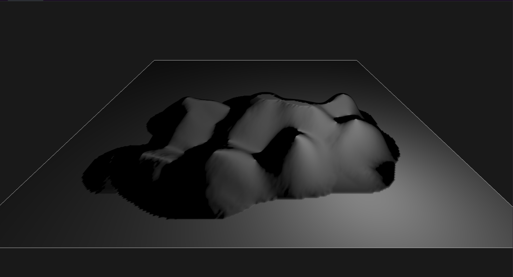
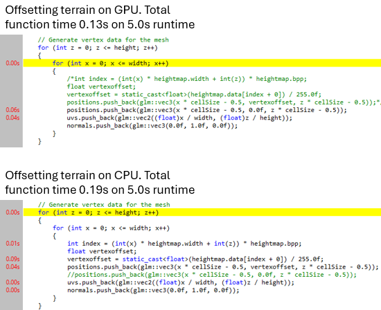

As a programmer, __I can analyse complex technical problems and research possible solutions__, so that I end up writing / integrating the right code for the job.

# 💭 Suggested Evidence
- References in the self-study plan
- Descriptions of programming problems researched

# 💯 Detailed Rubric

🔴 **Poor:** Some evidence of the development work being based on research. All sources are cited so that the same information can still be retrieved.

As of now I have used these sources: 
-   [Unreal Engine - Landscape Brushes](https://dev.epicgames.com/documentation/en-us/unreal-engine/landscape-brushes?application_version=4.27) and 
    [Unreal Engine - Landscape Technical Guide](https://dev.epicgames.com/documentation/en-us/unreal-engine/landscape-technical-guide-in-unreal-engine).
The two Unreal Engine articles helped me have a better understanding of what a landscaping brush is. The "Landscape Brushes" article gave me a better insight on what different types of brushes there are, what their usecases are and how they work. I also used some of the Unreal Engines UI in my own tool because in Unreal it looks clean and user friendly. The second article "Landscape Technical Guide" I used for seeing what file formats Unreal uses for their heightmaps and what some basic settings are. I was also interested in how the Unreal Engine preforms their calculations for the terrain and how they handle their landscape components. 

-   [Flax Engine - Terrain Editing](https://docs.flaxengine.com/manual/terrain/editing.html).
From reading the Flax Engine article I got the idea of storing my terrain inside of a heightmap. This article gave me better insight on how I can use a heightmap to paint and store a terrain. 

-   [Learn OpenGL - Rendering Using Height Maps](https://learnopengl.com/Guest-Articles/2021/Tessellation/Height-map).
After that I started reading the LearnOpenGL article on rendering heightmaps. At first I thought it was a good idea and I followed the article for a while but eventually decided on just passing in a flat plane to the GPU which I then offset in the shaders instead of ofsetting it on the CPU. But it did help with my decision to make use of the STB library to load in the heightmap. 

-   [Godot Engine - Vertex displacement with shaders](https://docs.godotengine.org/en/3.0/tutorials/3d/vertex_displacement_with_shaders.html?utm_source=chatgpt.com).
The Godot article helped me with understanding better what is needed to recreate their effect. Such as first adding in a plane with a given amount of subdivisions and how the basics of vertex offsetting in shaders work. 

🟠 **Insufficient:** For at least 2 relevant technical questions, the Learning Log shows that the student has researched and analyzed multiple possible solutions before reaching a conclusion. 
1. What file format should be used and what bit depth for the heightmap.
2. Should I offset the vertices on CPU or GPU and what are the good parts and downsides of both. 

<h3>What file format should be used and what bit depth for the heightmap?</h3>

When researching the file formats most feasable for my usecase I had a couple of contenders: 
- PNG, using this is nice because we can make use of the PNG lossless compression so our filesizes are smaller. We also have the STB library we can use to load and unload pixel data into memory. 
- OpenEXR, EXR files are mostly used for videography and film rendering. What makes OpenEXR nice is that it supports larger file formats with bigger bit-depth going like 16 half float, 32 and 64. There is also a nice library for loading and unloading files called [TinyEXR](#https://github.com/syoyo/tinyexr). 
- RAW, when storing my image data raw I can easily decide what bitdepth I want to use and I can make the data storing as complicated and usecase specific as I want. 

<h4>PNG</h4>
Some pro's of the PNG extension: 
- Lossless compression: this leads to way smaller files when saving the heightmap on disk.
- Used a lot: Everyone know what a png is and they are everywhere. This is nice because then the user can easily import their png files without having to either convert it first or find a heightmap with the right extension. 
- Easy to use: The STB library is fairly straight forward and loading data into memory is easy to do. When making use of the SBT library I wont have to handle topics such as file reading, loading into memory and taking care of that memory after it is loaded. 

Some cons I have come across are:
- The (de)compression also happens real time, so when loading or saving a file extra CPU time will be needed to make that process happen. 
- Not the highest available precision: STB supports 8 bit and 16 bit file loading which might not be enough if you want a really high precision terrain.

<h4>OpenEXR</h4>
OpenEXR, EXR for short, is a file format used a lot in film rendering and VFX. How I found out about this format was because of a friend of mine who studies VFX where they deal with EXR files all the time. 

Some pro's of the EXR extension: 
- Very high precision: EXR supporst for example 16-bit half-float and 32-bit float channels which makes for very high detail heightmaps. 
- Easy to use: TinyEXR is a single header library and very similar in use as the STB library. 

Some cons for EXR: 
- The file sizes will become very large because of the precision. So for 16-bit 1024x1024 image that would be around 8MB (RGBA) and for 32-bit that would be 16MB (RGBA) uncompressed. The compression might take away 20%-40% from that but it's still a lot. 
- Because of the filesize and the compression the loading time will also be a lot longer which might disrupt the workflow when it is happening real time. 
- Altough widely used in VFX outside of that it is not that familiar, so your average user would have to either keep looking for the right extension heightmaps or find a tool to convert it. 

<h4>RAW</h4>
Storing my heightmap data into a RAW file is fairly straight forward, just a huge binary dump.

Pro's for RAW:
- Reading and writing a binary dump is fairly simple and does not really require a lot of knowledge. 
- No extra time being spend compressing: Unlike with PNG and EXR here we just store our data uncompressed which makes it go a lot faster. 
- We can decide on our own what bit-depth we want to use making for more customizability. 

Cons for RAW:
- No compression: This just makes the file bigger on disk than it would be if we compress it like with EXR or PNG. 
- I have to write it myself: Even though it is fairly straight forward it is still a lot more error prone than using a library such as the STB. 
- Using RAW data storage for the heightmap makes it so I cant load other heightmaps which weren't made inside of that tool. So importing heightmaps becomes impossible. 
- No nice debugging, when making my tool I will probably hugely rely on the image viewer in windows to see if all goes right but that wouldn't be possible here. 

<h4>Conclusion</h4>
Looking at all the pro's and cons for every option I think I will go with the PNG 8-bit option which with compression would for a 1024x1024 file be around 1/2MB since the data will probably be very uniform in a lot of places. I also think that using a 0-255 height range for my heightmap will be enough. Also the wide usage of the PNG format and there being libraries like STB makes the choice to go for PNG a lot easier to make. 

And eventually looking at this image and looking back at my previously made decision I think I was right that for my usecase this was enough: 

<h3>Should I offset the vertices on CPU or GPU and what are the good parts and downsides of both?</h3>

When making a terrain you eventually have to decide how you want to render it. Having chosen to store my terrain data into a heightmap format I had 2 choices that came to mind:
1. Offsetting the vertices on the GPU. 
2. Offsetting the vertices on the CPU. 

<h4>Offsetting the vertices on the GPU</h4>
This seems like the obvious choice when looking at it from the performance point view. It's very repetitive work and with my data being stored inside of a texture this should be perfect. Though there is 1 downside to doing the vertexoffset on the GPU. It will become a lot harder to get good working mouse to terrain intersection. This is something we definitely want to calculate on the CPU but when we are offsetting all the vertexdata on the GPU this means that our terrain is completely flat for the CPU. So what would have been a simple ray to trianle intersection is now not possible anymore. Also vertex offsetting on the GPU should only be needed when we are having to constantly update the terrain, in other words only when we are actually drawing on the terrain. Doing the vertex offsetting every frame on the GPU is kind of useless when the terrain doesnt change anymore (when we load the terrain in a game setting and not the engine environment). 

<h4>Offsetting the vertices on the CPU</h4>

Offsetting the vertices on the CPU was not the first thing that came to mind for me but when looking into it further I came to realise that doing that also has it's plus points. As mentioned before calculating the mouse to terrain intersection will be a lot easier by just doing a ray to triangle check since we'd have all the mesh data on the CPU. Also when we are not in an engine environment and we dont have to update our terrain every frame, offsetting our vertices on the CPU only once at the start will result in a bit longer loading time but a better framerate overall. The obvious downside is if we have to update our vertices on the CPU every frame it wont be as cost efficient. 

<h4>The difference</h4>

Our time spent inside of the function goes from 0.13 to 0.19 when calculating and offsetting the vertices on the CPU. This is almost a 50% increase in function time by just calculating and offsetting the vertices on the CPU. The difference is quite big and you will really notice the difference when there are a lot more terrains in the scene. 

<h4>What does Unreal do?</h4>
The Unreal Engine also has a landscape editor. I was curious how the Unreal Engine handles it's landscape generation and see if their decisions and way of doing things could also be of use for me. Looking at some of their shader source code I can see that they also chose to sample the heightmap and offset the vertices of the heightmap on the GPU. Their shader source was definitely a lot more complex than what I did: 

`float height = texture(s_heightmap, a_texture0).r;`

`vec3 new_position = vec3(a_position.x, a_position.y + height, a_position.z);`

But after looking past all the extra stuff I saw they mostly did the same, sampling through the heightmap and offsetting the vertices of a grid based on the red channel of the heightmap by using functions like `UnpackHeight(float2)` and `LoadHeightmapUnpackedHeight(uint2)`. 

<h4>Conclusion</h4>
I have eventually decided to go for the GPU route. This is because of a couple reasons. 
- Looking at the profiling we did comparing CPU and GPU vertex offsetting we see a clear winner. 
- We could choose that when we are in a game setting we load the terrains once on the CPU instead of offsetting them on the GPU every frame but the performance we gain from that is very minimal. And if I eventually decide to add in chunck loading the user could expect lag spikes when entering a new area instead of the GPU doing the same amount of work all the time. 
- Unreal does it aswell, this also plays a huge factor for me. Unreal's landscape rendering works very well and seeing that next to vertex offsetting they also do stuff like LoD'ing and culling on the GPU it would only make sense to put the vertex offsetting in there aswell. 
- The only slight downside I would see to not doing the offsetting on the CPU is that the mouse to terrain intersection will be a bit more of a challenge, but I have been thinking of ways to solve this and was thinking of raymarching the heightmap to get an intersection point. 

🟡 **Sufficient:** For at least 3 relevant technical questions, the Learning Log shows that the student has made well-argumented decisions based on their research. Information has been collected from a variety of sources.

🟢 **Good:** Evidence of multiple iterative research processes of finding information, making decisions, implementing, evaluating, and possibly going back to a previous step when needed.

🔵 **Excellent:** Evidence of a research-driven attitude throughout the block, with an appropriate balance between thinking and doing. The Learning Log shows critical reflection and lessons learned about research-driven development.

# 🔍 Evidence

...
