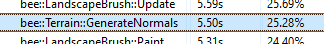
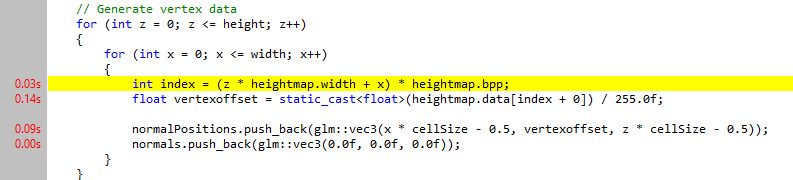
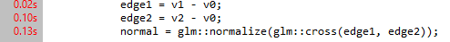
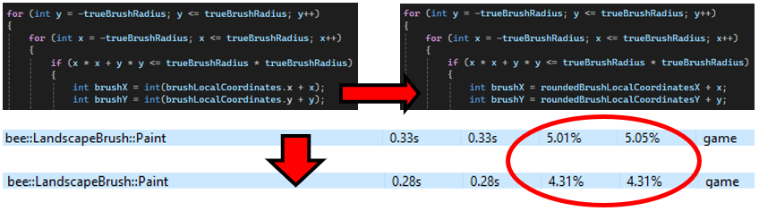
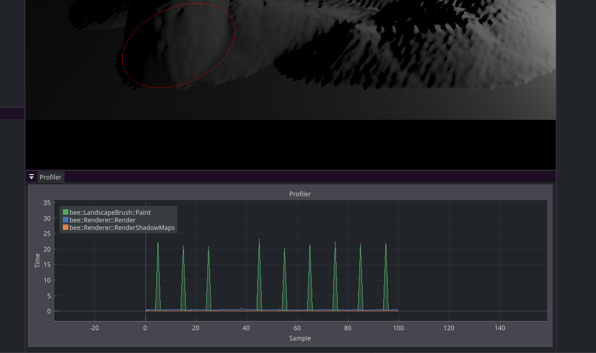
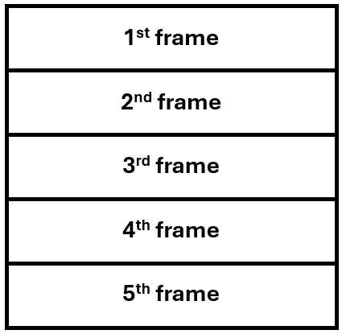
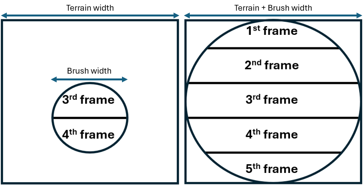

As a programmer, __I profile and optimize my code using the appropriate tools and techniques__, so that my software works efficiently even in challenging scenarios.

# 💭 Suggested Evidence
- Profiler output -> Descriptions of optimizations -> Improved profiler output
- Videos / code of stress tests
- Analysis of performance / algorithms

# 💯 Detailed Rubric

🔴 **Poor:** Some evidence of profiling the performance of the student's codebase.

For my profiling tool I made use of VerySleepy. By far my most used function every frame is recalculating the normals for every frame 255x255 = 65,025 times. This is really preformance heavy when the glm normalize and cross functions get called 65,025x2 per frame whilst also looping through the entire heightmap and reading all the pixel values. 

**Total CPU usage:**




**Biggest Hotspots:**




🟠 **Insufficient:** Evidence of executing the stress tests as outlined in the plan and profiling them using the appropriate tools, enough to indicate a basic understanding of profiling. 

I had two stress test parts: More terrain subdivisions and a bigger brush. 1 of these will not be working because in week 6 I realised that the max bee can handle is 255x255. But I could still test the bigger brush. This will serve as a good stress test because then we can see how many pixels the brush could theoredically update per frame. 

🟡 **Sufficient:** Evidence of non-trivial optimizations in the codebase based on the profiling results of the stress tests. The student clearly shows their process of profiling, optimizing the code, and verifying the outcome.

When turning off the normal generation we can have a better look at what else is going on inside of the code performance wise, since the normal generation is the main bottleneck. 

**The Paint() function**

At a brush size of 2000 and about a 5 sec application time we can see that what took a lot of time was for every pixel the brush was updating it was also casting ```localBrushCoordinates``` into an integer. I realised that I could move the casting outside of the nested loops this made some nice improvements on performance. 


This made the ```Paint()``` function go from a total time percentage of 5.01% to 4.31%. 

Other than that there are some other small things such as putting ```trueBrushRadius * trueBrushRadius``` outside of the loop so we can use ```trueBrushRadiusSquared``` multiple times in the loop without recalculating it every time. Though it is cleaner, in the grander scheme of things it doesnt make a huge difference.  

**The GenerateNormals() function**

In week 6 I added the normal generation as a stress test and since this is my main bottleneck I think it's smart if I shift all my attention towards it. 

My ```GenerateNormals()``` function consists of 2 operations. 
1. First we read the heightmap as pixel data which we then store into vertices with an applied offset from calculated from the pixeldata. ```static_cast<float>(heightmap.data[index]) / 256.0f;``` We then put those into a list which we will use for the normal generation. 
2. In the 2nd part of the function we grab the vertexdata calculated before and put put the edges of the trianles into the glm crossproduct function which we then normalize. This happends two times (for both triangles). 

Both of these steps are needed and are already fairly bare bones, so instead of changing the function I will just change how much we update them. 



But this still doesnt fix our issue. Now every 10 frames the normals get recalculated and every 10 frames we will get a lagspike. 
So instead of this I will still use the frame interval but instead of waiting 9 frames and doing nothing I will split the heightmap into seperate parts, then the load is spread over multiple frames. 

Just like this I will devide the heightmap into a couple of strips and every frame I will update 1. 


But besides this we could also use our brush radius to only update the normals that are being worked on that frame. Though this would mean that we still have the same issue when the user has a really big brush. 

To combat that we can just combine both the optimizations which would look like this: 


🟢 **Good:** The profiling and optimization work clearly looks for the limits of the developed features, e.g. by testing multiple values of multiple relevant parameters. This shows that the student has good insight into the scalability of the system.

🔵 **Excellent:** The work leads to highly optimized code and/or good future optimization opportunities. The student shows a deep understanding of optimization and performance analysis within the project's domain (e.g. algorithmic analysis, hardware constraints, etc).

# 🔍 Evidence

...
