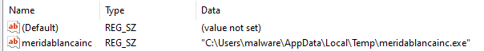
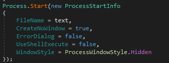
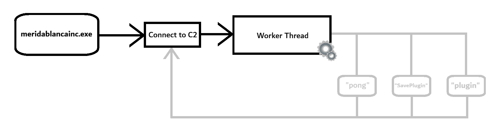

# AsyncRat

**MITRE ATT&CK mapping**
| ID | Meaning |
|--|--|
|T1059.003 | Command shell  |
|T1053.005 | Scheduled Task |
|T1547.001 | Registry Run Key |
|T1056.001 | Keylogging|
|T1082 | System Information Discovery |
|T1571 | Non-Standard Port (6606, 7707, 8808)|
|T1573 | Encrypted Channel |
|T1497 | Virtualization/Sandbox Evasion |
|T1106 | Native API (RtlSetProcessIsCritical)|

**IOC's**  
| FileName | MD5 | SHA-256 | File Size |
| --- | --- | --- | ---|
| tmp7496.tmp.bat | 22931ea0a16d5b9a22f6ce9449cecc9c | e60ebf4fd3bfe21860186fe6fb62316a1ca5a6d4f33afa6a0382c2311eb9a549 | 166 | 
| meridablancainc.exe | 4adf9c72227eb3c9e83786d707e8ffc3 | 7dc210f03439607ff5c6faf699b5e3b21f9b38bdf8a89339797b4fffe6dfb505 | 48.640 |

| Registry | key | value |
| --- | --- | --- |
| SOFTWARE\Microsoft\Windows\CurrentVersion\Run | meridablancainc | "C:\Users\malware\AppData\Local\Temp\meridablancainc.exe" |

**Mutex name**: koMgGRwEyKzt 


---
---

## Stage 1 - Decrypting strings, Anti-Analysis and Persistence 

## Anti-Analysis
This version of AsyncRat was not too obfuscated. It only used pseudorandom names for every variable and encrypted strings which made reading large portions of code a bit confusing, but not too difficult.  
Other versions of AsyncRat are known to have other obfuscation techniques such as control-flow flattening or having Multi-Stage Crypters.  


### Decrypting strings

The malware starts by decrypting a bunch of stored strings.  
It uses **AES-256** encryption for its strings.  

```csharp
masterKey = Encoding.UTF8.GetString(Convert.FromBase64String(masterKey));
Decoder decoder = Decoder(masterkey);
string = decoder.StringDecoder(string);


// Decoder.StringDecoder()
public string StringDecoder(string str)
{
	return Encoding.UTF8.GetString(this.Decrypter(Convert.FromBase64String(str)));
}

// Decoder.Decrypter 

public byte[] Decrypter(byte[] str)
{
	using (MemoryStream memoryStream = new MemoryStream(str))
	{
		using (AesCryptoServiceProvider aesCryptoServiceProvider = new AesCryptoServiceProvider())
		{
			aesCryptoServiceProvider.KeySize = 256;
            // EAS setup
            
			using (HMACSHA256 hmacsha = new HMACSHA256(this.K64bitKey))
			{
				// Check hash HMAC
			}
			using (CryptoStream cryptoStream = new CryptoStream(memoryStream, aesCryptoServiceProvider.CreateDecryptor(), CryptoStreamMode.Read))
			{
				// Decryption
			}
		}
	}
	return decrypted_string;
}

```

**List of interesting resolved strings:** 
| resolved string | context |
| --- | --- |
|"paVMhveCgGbn5B9oqznhleLTxpgBiLhK"| This was a Base64 decoded string which is used as a "MasterKey" for the decryption of the other strings. |
| "6606,7707,8808,443,8080" | Something what looks to be a list of ports |
| "meridablancainc.it.com, 172.67.149.20, 104.21.41.177, 2606:4700:3037::ac43:9514, 2606:4700:3037::6815:29b1, linda.ns.cloudflare.com, julian.ns.cloudflare.com" | A bunch of DNS addresses, IPV4 and IPV6 addresses combined into 1 string. | 
| "0.5.8" | The version of AsyncRat |
| "koMgGRwEyKzt" | The name of the spawned Mutex |
|"274628A11919AC99EE7C" | The path inside of the registry where loaded plugins are stored. | 
| [CryptoSignature](#cryptosignature) - In the "src" header | A big string which is being used as a Cryptography signature later in the code. |

The malware also creates a new X509 certificate using .NET's `X509Certificate2()` function.  
Looking into the newly created struct we can see the name of the Issuer being: `CN=AsyncRat server`.  
We also see some interesting settings for this certificate, e.g. there is a public key which uses `"RSA-PKCS1-KeyEx"` as a KeyExchangeAlgorithm and uses SHA1 as its SignatureAlgorithm. 

### Pass Anti Debugging
- Checks whether the string "vmware" or "VirtualBox" is present inside of the any of the ManagementObjectSearcher strings.
- Checks for debuggers attached using `CheckRemoteDebugger()`.
- Checks for loaded DLL `"SbieDll.dll"` being present (a dll found in sandboxie).
- Checks the disk size of the device
- Checks whether the windows version is running on XP. 

### Persistence
The malware decides its persistence based on its privilege level. 

- If the malware has **Administrative Privileges**, it open CMD and use the following command:  
`/c schtasks /create /f /sc onlogon /rl highest /tn \"meridablancainc.exe"\" /tr '\""{C:\Users\malware\AppData\Local\Temp\meridablancainc.exe}"\"' & exit"`  
This command creates a scheduled task which gets run on logon with admin privileges. It targets the executable that will be inside AppData/Local. 

- If the malware has **User Privileges**, it will go into the Run registry key and will place itself there.   

After this the malware copies itself into `C:\Users\malware\AppData\Local\Temp\meridablancainc.exe`.

The malware opens a temporary file, adds the .bat extension to it and writes the following batch script: 
```bat
@echo off
timeout 3 > NUL
START "" "C:\Users\malware\AppData\Local\Temp\meridablancainc.exe"
CD C:\Users\malware\AppData\Local\Temp\
DEL "tmp7496.tmp.bat" /f /q
```
This script starts the newly written to meridablancainc.exe and deletes the temporary .bat file. 

This batch script is then run like this:  
  


### Setting process flags
If the process has the right privileges, it will do the following: 

- The SessionEnding variable is increased.   
- Using the `Process.EnterDebugMode()` function, this allows the malware to get the same privileges as a debugger (which is more than a regular process).  
- RtlSetProcessIsCritical (1,0,0) is called which flags the process as a critical process. 


### SetThreadExecutionState
The thread's execution state is set to the following flags: 
- ES_CONTINUOUS
- ES_DISPLAY_REQUIRED 
- ES_SYSTEM_REQUIRED


## Stage 2 - Payload
The malware enters an infinite loop which looks like this: 
```csharp
for (;;)
{
	try
	{
		if (!c2.connected)
		{
			c2.C2StillValid();
			c2.ConnectC2();
		}
	}
	Thread.Sleep(5000);
}
```

### Making a connection
Inside of `ConnectC2()` the malware gets a random IP address from this list: 
- meridablancainc.it.com
- 172.67.149.20 
- 104.21.41.177 
- 2606:4700:3037::ac43:9514
- 2606:4700:3037::6815:29b1 
- linda.ns.cloudflare.com
- julian.ns.cloudflare.com  

It then gets a random port number out of this list: 
- 6606
- 7707
- 8808
- 443
- 8080   

The malware establishes a TCP based connection using the .NET Socket structure. If it succeeds it continues to the following. 


### Sending/receiving data
1. **Sends initial data to the C2.** The RAT will send a list of variables tied to the user's machine: 
    - HWID
    - UserName
    - OSFullname + Version
    - ExecutablePath;
    - Privilege Level
    - Pastebin
    - Installed Antivirus
2. **KeyLogs every so often.** Using `ImportedFunctions.GetWindowText(ImportedFunctions.GetForegroundWindow(), stringBuilder, 256)` the malware sends this information to the C2 in random intervals. 
3. **Opens a new Thread.** This thread handles direct server to device communication. The server can send 3 commands: 
    - Pong: Resets connection
    - Plugin: Reads a hash of the requested DLL, looks it up in the registry to see whether the requested plugin is already present on the device. The hashes of the plugins are stored in `HKCU\Software\74628A11919AC99EE7C`.
    - SavePlugin: Downloads the raw bytes of this DLL, stores it in the registry and runs the DLL.   


  
*This is what the structure globally looks like.* 


## Meridablancainc

### FB88 impersonation
The malware tries to connect to the earlier resolved meridablancainc.it.com. The it.com is a smart way of acting like your website is an official .com site. So opening a site like microsoft-login.it.com looks a lot like opening the actual microsoft login site. Next to this, registering like this is generally faster and cheaper than registering you own domain. 

After having pinged meridablancainc.it.com to see whether the site is up and running, it was!

Visiting the website I was welcomed with a vietnamese sport gambling website.  
The website impersonated fb88.com which is an legitimate sport gambling website in Asia. Though whenever I clicked something on the site some JS started running and installed these extensions to my Google Chrome:  
  
These all look like some crypto wallet/password managing extensions. 

### Server taken down
1 day after having pinged the website the server all of the sudden did not respond anymore.  
  
This could have a couple of reasons: 
1. The server noticed my pings in the logs and went on a temporary shutdown to prevent analysis. 
2. The server noticed my pings in the logs and the people running the network decided to stop it and port the C2 server to another location. 
3. The server got taken down by law enforcement. 1/2 days after I pinged the server, Dutch Police and NCSC posted this announcement: https://www.politie.nl/nieuws/2026/mei/28/06-politie-en-ncsc-halen-groot-botnetwerk-offline.html. There is a small chance this server was part of this botnet, but it's possible. 

I think reason nr. 1 is the most realistic, the server went on a temporary shutdown to prevent analysis/to act like it's dead, only to continue after a couple of days. 

### meridablancainc.it.com history
Looking at `https://crt.sh/?q=meridablancainc.it.com` we can see their earliest issued public SSL/TLS certificate was way back in `2025-04-10`. 
And their latest was (at the time of writing this) just 3 days ago being `2026-05-26`. 
			
|crt.sh ID | Logged At  ⇧ |	Common Name	|Matching Identities	|Issuer Name|
| ---| ---| ---| ---| ---|
|26648280284	|2026-05-26	|meridablancainc.it.com|	meridablancainc.it.com|	C=US, O=Google Trust Services, CN=WE1
| Other Logs|  |  | | |
17761978605	|2025-04-10	|meridablancainc.it.com	|*.meridablancainc.it.com|meridablancainc.it.com	|C=US, O=Google Trust Services, CN=WE1

This means this specific DNS has been active for over 13 months. 


## src

##### **CryptoSignature** 
```
"jJqkHVfnDBC/jFemVk+t1bAJHp00GmH9Y9JM3K1teNnGF04jOxk0wlFoEpKwKg9KTXB1syde/mcY9bELg6rv/TRFfLYfqfcTOWbcxfl/Xzw1Tlu7QVrtx2o0YWKUwkQuJu5sV0HcJFci6tdfjO+0Tb7UO0P79ZDZOm0+CGrzxrkjBgZqYWHqGu9zjFlrkMkfGZLvwS1L1bvb0UXIA33/ioS57geMRaXcGP3RMbOpzkLTjlGGOdQiRX6fSRE+3YDNZ4ggRAj4qgQN9M4uVSLwZuZFPysQLqUat6Dbaxjm1HFSGP0D2UJxbA+6wIY+Qamkb+n+NLgYyZ6KCNSuKj1KyhqIbYHZ1spXO+bKCjT13PSO50qvARGGOk3bnacspLo02Zzjkfh3u35fdab8+MQ37UWNrjBKezUO0zlbQyjjte6ecMlGCsOLMGBYeZues2ftoB04efIKwkeREuTPefs7fF67Ka8UzpxR63TfVEWBqVrrVi88I4WiJzxRWKsgpZLpa/WP7aPHTGSWZ6yY5e8hyzw25HegfanbhsfKnWzwIq8z941+SP+8dfm+31VYM3SR7Nhga2lSSYgrNyaWgNhSRYcIQq6Coh6EcJYRHfC4QLcQz8eXUy6Ul5RPJb0n0CWLp4NnCVr3SKy0CH/Vs2VpgG3RC/rCuwkhRZwnxOHb0M4="
```

### Resources
- https://crt.sh/?q=meridablancainc.it.com
- https://www.isitdownrightnow.com/