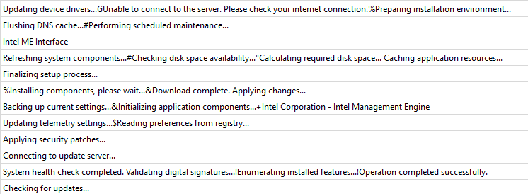
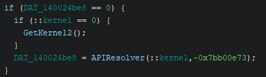
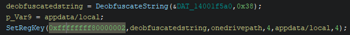
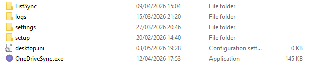
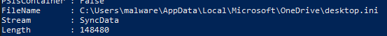
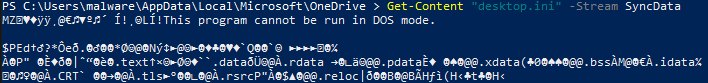
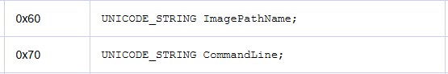
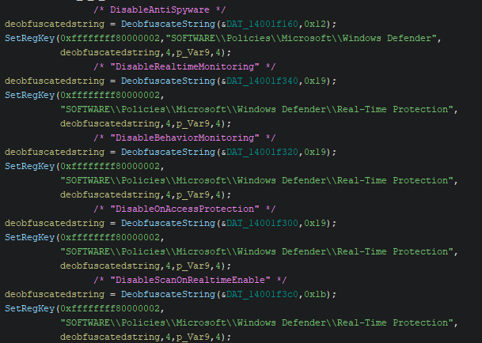
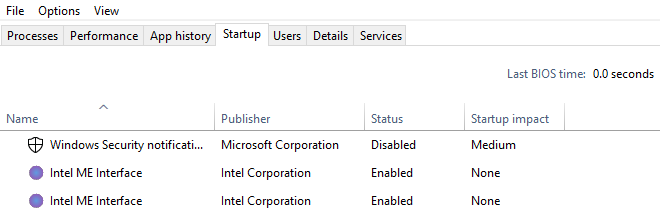

# MaaS RAT

## File information 

**IOC's**  
SHA256: a20c6ce14064a4526d9342b02c69f18852978eb8bb8c5100b6f04c893b7d096e   
Relevant IP: 130.12.180.28   
Suspected malware type: Maas RAT  
File paths: AppData\Local\Microsoft\OneDrive\OneDriveSync.exe  

**MITRE ATT&CK mapping**
| ID | Meaning |
|---|---|
|T1027.007|Obfuscated Files or Information: Dynamic API Resolution|
|T1036 | Masquerading the PEB | 
| T1547.001 | Registry Run Keys |
| T1102  | C2 and blockchain |
| T1070.006 | Indicator Removal: Timestomping (copying notepad.exe's file time)|
| T1564.004 | Hide Artifacts: NTFS File Attributes (desktop.ini:SyncData ADS stream)|

## Initial analysis
Loading the executable into PE bear and pestudio I see some suspicious imports in the IAT. Some of these imports are: 
- Quite some bcrypt.dll imports
- GetLastInputInfo
- GetTokenInformation
- Virtual protect + VirtualQuery

Looking at the strings we see a lot of user messages, indicating this could be some type of trojan. 

 

## Obfuscation 
### API hashing
The IAT shows some suspicious imports but not too much. The reason for this is because this executable dynamically resolves a lot of its API calls using API hashing. Looking around in Ghidra this malware is full of it. 

All these hashes use the same APIResolver function. Using the debugger I was able to let the malware unravel itself without me having to do a whole lot.
After dynamically resolving these API calls we got a new list of functions which were not yet present in the IAT:

| Flagged import | Non-Flagged import |
|---|---|
| WriteProcessMemory | VirtualAlloc |
| SetThreadContext | VirtualFree |
| CreateThread | VirtualProtect |
| CheckRemoteDebuggerPresent | CloseHandle |
| CreateToolhelp32Snapshot | Sleep |
| TerminateProcess | GetCurrentProcess |
| WinHttpOpen | GetCurrentProcessId |
| WinHttpConnect | GetCurrentThread |
| WinHttpOpenRequest | GetSystemInfo |
| WinHttpSendRequest | GetModuleFileNameA |
| WinHttpSetOption | GetModuleHandleA |
| WinHttpCloseHandle | GetFileAttributesA |
| RegCreateKeyExA | GetComputerNameA |
| RegOpenKeyExA | WideCharToMultiByte |
| RegSetValueExA | wsprintfA |
| LoadLibraryA | WriteFile |
| GetProcAddress | ReadFile |
| SHGetFolderPathA | WaitForSingleObject |
| FatalExit | |

Having labeled these in Ghidra I can more easily start to statically analyze this executable. 

### String obfuscation
The strings found inside of PE bear are quite useless and are more for convincing analysts/anti-viruses how "safe" this executable is.  
The actual string deobfuscation happens inside of its own DeobfuscateString functions. 

These are also very easy to dynamically resolve using the debugger. For example, the data held in DAT_14001f5a0 became `"SOFTWARE\\\\Microsoft\\\\Windows Defender\\\\Exclusions\\\\Paths"` after having gone through this deobfuscation function.  

This mostly gets used to hide its usage of the Registry and resolving server/ip-addresses. 

## Persistence  
This executable does quite a lot of things to make sure it stays in the infected PC without being detected. 

### Hiding itself 
Using SHGetFolderPathA, the executable gets the direct path to `C:\Users\<username>\AppData\Local\Microsoft\OneDrive`. After which it copies itself from the Downloads folder to this folder where it will name itself `OneDriveSync.exe`.  
To make sure it is harder to detect the malware will get the path to notepad.exe inside of `Windows\system32` and it will get the last modified date of notepad and sets its own file time to that of notepad's. This is done using the SetFileTime function. 

  

After this it will copy itself into a stream inside desktop.ini. The reason it uses streams is because this makes sure the filesize stays 0 (see image above), it exists in a stream of the file and not the file itself.   
It uses desktop.ini:SyncData as a stream. 

This is proven by using `Get-Item "desktop.ini" -Stream *`:   
  
And by using `Get-Content "desktop.ini" -Stream SyncData`:  
We can see the beginnings of a windows PE file. 

### Cool PEB stuff
Next to this the malware also does some very tricky PEB shenanigans.  
Using the legendary Geoff Chappell's [blogposts](https://www.geoffchappell.com/studies/windows/km/ntoskrnl/inc/api/pebteb/rtl_user_process_parameters.htm) I can easily traverse what the malware is trying to access.  

PEB = `MOV RBX,qword ptr GS:[0x60]`  
ProcessParameters = `MOV RSI,qword ptr [RBX + 0x20]`  
ProcessParameters.ImagePathName = `RuntimeBroker.exe`  
ProcessParameters.CommandLine = `"C:\\Windows\\system32\\RuntimeBroker.exe -Embedding"`  

Doing this, the malware changes its complete appearance for every other program that accesses the PEB for identification (e.g. process explorer and task manager). The reason the malware hides as RuntimeBroker.exe is because it is a very common background task to run. This is quite an easy but sneaky way to trick analysts. 

### Anti Defender
The malware uses multiple instances of the registry to change settings in the OS to go undetected. Programs can't just go ahead and change a bunch of settings in Microsoft Defender, but its easier than you might think. 

This malware first tries to manually add itself as an exclusion by accessing `HKLM\SOFTWARE\Microsoft\Windows Defender\Exclusions\Paths`. Though when it tries to do this the OS will probably deny this request.  
If that is the case the malware accesses the registry key TamperProtection inside of `Windows Defender\Features`. It turns that off and then it tries to access the earlier registry key again and succeeds.  
After succeeding it will turn off all of these registry values which protect the user from malware. 

*Note: Normally unprivileged programs such as these are not allowed to touch TamperProtection, but here it can since my Virtual Machine sandbox has a bunch of MSDefender features turned off.*

### Auto run
In order to keep running, even when the user closes their PC, the malware does the following. 
- Puts itself (OneDriveSync.exe) inside of the `HKLM\SOFTWARE\Microsoft\Windows\CurrentVersion\Run` registry, where it calls itself: MicrosoftEdgeUpdateSvc. 
- Puts itself (OneDriveSync.exe) inside of the `HKCU\Environment\UserInitMprLogonScript` registry, where again it calls itself: MicrosoftEdgeUpdateSvc.
- Adds itself as a startup app   

## The Logic/payload

### RAT behavior
The actual payload gets activated in a separate Thread. This thread handles some networking which looks like a C2 where the attacker can have direct communication with the malware on the victim's PC. An interesting function is some type of command handling thread which is ran after the malware got a response from the attacker's server.  
The malware compares the strings from the command and then decides what to run. The malware offers 12 different functionalities:  
- **"EXECUTE"**: Executes shell commands  
- **"DOWNLOAD":** Downloads a file to the victim's PC
- **"RUNPE"**: Runs a Windows Portable Executable on the victim's machine 
- **"SCREENSHOT"**: Makes a screenshot from the victim's machine
- **"INFO"**: Gathers information such as computer name, username, windows version, processor, last input info, etc. 
- **"LS"**: lists files in a directory 
- **"DRIVES"**: Lists drives
- **"UPDATE"**: Allows the attacker to update/patch the malware
- **"UPLOAD"**: Upload a file from the victim's PC to the attacker's server
- **"DELETE"**: Delete a file from the victim's machine
- **"ELEVATE"**: Elevate privileges
- **"KILL"**: Kill the malware

*Note: These are my conclusions for the actual behavior. There is a lot of code and it would take a while to understand every single functionality. So this is a prediction based on their name + functions that are present in the code.*

### Server address
A server address that kept coming up when debugging networking function calls was `130.12.180.28`. It looks like the malware kept trying to send requests to this address. 

Looking at the IP address on abuseipdb.com (https://www.abuseipdb.com/check/130.12.180.28) we see that it has been flagged multiple times by other people reporting it for hacking, spam and being a C2 beacon. The IP address's location switches from site to site with some being in Germany and others saying it's in The Netherlands in North-Holland. 

### BlockChain Fallback 
Inside of the thread that launches the command resolving thread, there is a piece of code which keeps track of the amount of connection tries the malware has tried to make with the IP stated above. If this count goes above 3 times, the malware resorts to trying to connect to 10 different other addresses: 
1. polygon.drpc.org
2. polygon-bor-rpc.publicnode.com
3. polygon.lava.build
4. polygon.rpc.subquery.network/public
5. polygon-pokt.nodies.app
6. polygon.gateway.tenderly.co
7. gateway.tenderly.co/public/polygon
8. api.zan.top/polygon-mainnet
9. 1rpc.io/matic
10. polygon-mainnet.public.blastapi.io

I knew these were blockchain crypto infrastructures, but why the malware tried to connect to these addresses I did not know. I was a bit puzzled.  
After having done some research and having used AI for a bit to guide me in the right direction I concluded that this is a fallback mechanism.   
Whenever the primary C2 is no longer reachable (has been taken down for example), the malware falls back to using a new configuration from the Polygon blockchain. Reason is because these C2 addresses are stored on a on-chain in a smart contract which makes them uncensorable and near impossible to take down. 

This also makes me think this is not only a RAT but it could also be a botnet. Because the only reason I can think of why the attacker puts this much effort in keeping in touch with its victims is if they're needed for some botnet attack. 

## Final verdict
I think with everything that I found I can say that I have been dealing with some type of RAT (Remote Access Trojan). The way it tries to disguise itself and its need for persistence tell me it's some type of Trojan. The Remote Access part comes in when the malware tries to connect with the server. The options the malware gives the attacker makes this piece of malware capable to a lot of things. From info stealing to being a part of a botnet. 

The reason I think it might also be MaaS(Malware as a Service) is because of its use of ID's when sending HTTP requests. This could be an indicator that several others might be making use of the same functionality under different ID's.  
I also find the malware to be quite clear for the attacker, with there being debug messages for example.  
My final reason for it being MaaS is that the malware is quite broad. As said before it ranges from info stealing to having full botnet functionalities. It seems that this malware was not crafted for 1 single purpose but more to be as versatile as possible to attract more customers.  